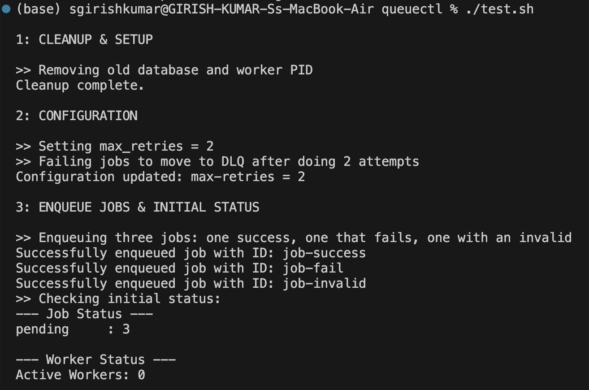
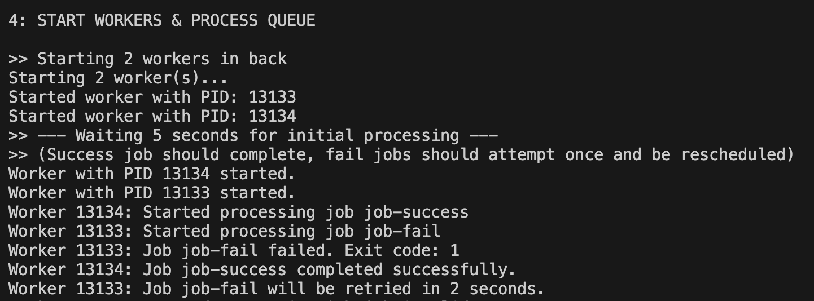
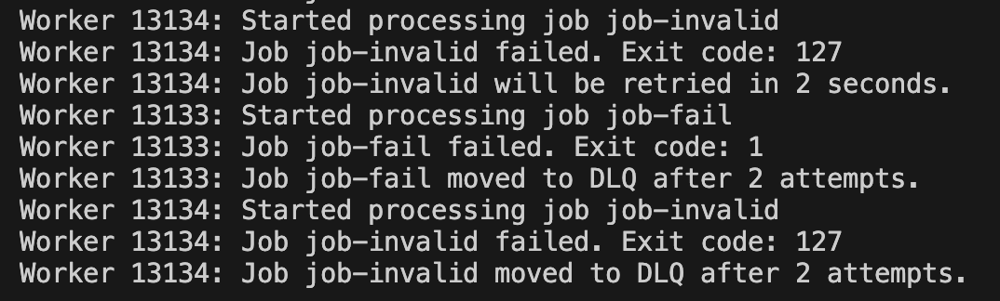
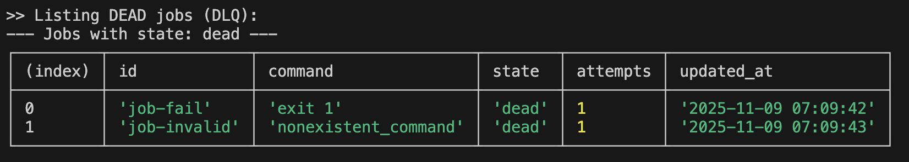
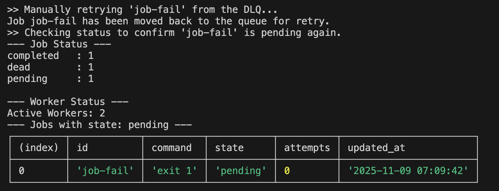

# QueueCTL - A CLI-based Background Job Queue System

This project is a minimal, production-grade background job queue system built with Node.js. It allows users to enqueue shell commands as jobs, which are then processed by one or more parallel workers. The system is persistent, robust, and features an automatic retry mechanism with exponential backoff and a Dead Letter Queue (DLQ) for failed jobs.

---

### Project Goal

The objective is to build a fully functional, command-line-driven job queue called `queuectl`. The system is designed to handle asynchronous tasks reliably, manage worker processes, persist job data across restarts, and provide a clean, intuitive CLI for all operations.

---

### Features

-   **Persistent Job Storage:** Uses SQLite to ensure jobs are never lost, even if the system restarts.
-   **Multiple Worker Support:** Process jobs in parallel by running multiple worker processes.
-   **Atomic Operations:** Prevents race conditions and ensures no two workers can process the same job.
-   **Automatic Retries & Exponential Backoff:** Failed jobs are automatically retried with an increasing delay (`delay = base ^ attempts`).
-   **Dead Letter Queue (DLQ):** Jobs that exhaust all retries are moved to a DLQ for manual inspection and intervention.
-   **Graceful Shutdown:** Workers finish their current job before exiting, preventing data corruption or incomplete work.
-   **Dynamic Configuration:** System settings like retry count can be managed via the CLI.
-   **Clean & Intuitive CLI:** All functionality is exposed through a well-documented command-line interface.

---

### Tech Stack

-   **Language:** Node.js
-   **CLI Framework:** `commander.js`
-   **Persistence:** SQLite3
-   **Dependencies:** `sqlite`, `sqlite3`, `uuid`

---

### Architecture Overview

The system is architected around a decoupled design where the CLI and the Workers communicate exclusively through a central SQLite database.

1.  **CLI (`queuectl`)**: The user-facing tool. It acts as the "producer", adding jobs to the database or sending commands to manage the system. It is stateless and exits after each command.
2.  **SQLite Database (`queue.db`)**: The single source of truth. It stores all jobs, their states (`pending`, `processing`, `completed`, `failed`, `dead`), and system configuration.
3.  **Workers**: These are the "consumers". They run as independent, long-lived background processes. Each worker continuously polls the database for a `pending` job, executes it, and updates its status based on the outcome.
4.  **PID File (`.worker.pids`)**: A simple file on disk used to track the Process IDs of running workers, enabling the `stop` command to gracefully terminate them.

---

### Key Outputs and Screenshots

Here are screenshots demonstrating the key functionalities of `queuectl`.

#### 1. Enqueuing Jobs & Checking Initial Status
This shows adding new jobs to the queue and the initial status summary before any workers are started.



#### 2. Workers Processing Jobs in Parallel
This screenshot captures the real-time log output from two workers processing jobs concurrently. The first image shows the workers starting, and the second shows their live log output.




#### 3. Job Failure, Retry, and DLQ
This output shows a job failing, being retried, and finally moving to the Dead Letter Queue (DLQ) after exhausting its retries.



#### 4. Listing and Managing the DLQ
This demonstrates listing jobs in the DLQ and manually retrying a failed job.



---

### How to Run

#### 1. Setup

**Prerequisites:**
-   [Node.js](https://nodejs.org/) (v14 or higher)
-   npm (comes with Node.js)

**Instructions:**
1.  Clone this repository:
    ```bash
    git clone https://github.com/your-username/queuectl-backend-project.git
    cd queuectl-backend-project
    ```

2.  Install the required dependencies:
    ```bash
    npm install
    ```

3.  Create a global `queuectl` command by linking the package. This allows you to run `queuectl` from anywhere in your terminal.
    ```bash
    npm link
    ```
    You're all set up!

#### 2. Usage Examples (Command Line)

Here are the primary commands to interact with the system.

**A) Enqueue a New Job:**
```bash
# Enqueue a simple job that will succeed
queuectl enqueue '{"id":"job1", "command":"echo Hello World"}'

# Enqueue a job that will fail
queuectl enqueue '{"id":"job2", "command":"exit 1"}'
```
**B) Start and Stop Workers:**
```bash
# Start 3 worker processes in the background
queuectl worker start --count 3

# Stop all running workers gracefully
queuectl worker stop
```

**C) Check System Status:**
```bash
# Get a summary of job states and active workers
queuectl status
```

**D) List Jobs by State:**
```bash
# List all pending jobs (default)
queuectl list

# List all completed jobs
queuectl list --state completed
```

**E) Manage the Dead Letter Queue (DLQ):**
```bash
# View all jobs that have permanently failed
queuectl dlq list

# Move a failed job back to the queue for another try
queuectl dlq retry job2
```

**F) Configure the System:**
```bash
# Set the maximum number of retries for new jobs to 5
queuectl config set max-retries 5
```

#### 3. Running the Test Script

A comprehensive test script is included to validate all core features of the application. This script will automatically clean up, enqueue jobs, start workers, wait for processing, verify the outcomes, and test the graceful shutdown.

**To run the test, simply execute the script from the project root:**
```bash
chmod +x ./test.sh
./test.sh
```
